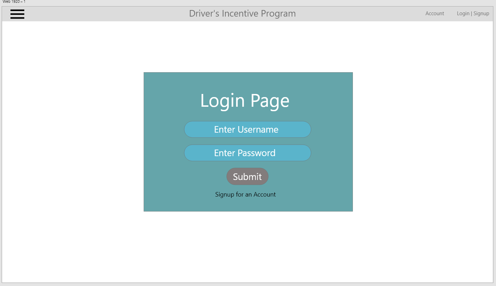

# What I did for Sprint 2
1. Created a Login Page UI mockup in Adobe XD

2. Connected directly to the database in Ryder
3. Made a query to see the table in our database
4. Learned how to correctly store database connection strings as user secrets
5. Completed a pull request and went through a review with Jay
6. Learned how C# handles background services
7. Researched framework more thouroughly